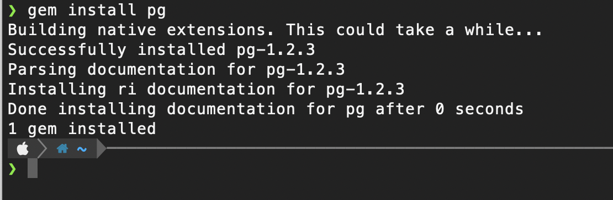

# Tips when installing Rails with Postgres on Macbook M1 natively

## Tip 1 - Make sure your terminal is NOT using Rosetta

Type: `brew config`

Make sure, you're running the terminal with Rosetta 2 set to `false`. Same goes for the homebrew install.

```
HOMEBREW_VERSION: 3.3.1
ORIGIN: https://github.com/Homebrew/brew
HEAD: 5889b44a6031af91b14ee7c7805e64d1b10ad51c
Last commit: 5 days ago
Core tap ORIGIN: https://github.com/Homebrew/homebrew-core
Core tap HEAD: 0e3e8be13f0bcec89f7762b7d13f9409b1c5e4d0
Core tap last commit: 3 hours ago
Core tap branch: master
HOMEBREW_PREFIX: /opt/homebrew
HOMEBREW_CASK_OPTS: []
HOMEBREW_CORE_GIT_REMOTE: https://github.com/Homebrew/homebrew-core
HOMEBREW_MAKE_JOBS: 8
Homebrew Ruby: 2.6.3 => /System/Library/Frameworks/Ruby.framework/Versions/2.6/usr/bin/ruby
CPU: octa-core 64-bit arm_firestorm_icestorm
Clang: 13.0.0 build 1300
Git: 2.30.1 => /Applications/Xcode.app/Contents/Developer/usr/bin/git
Curl: 7.64.1 => /usr/bin/curl
macOS: 11.6-arm64
CLT: 12.5.0.22.9
Xcode: 13.1
Rosetta 2: false
```

## Tip 2 - use native packages through the whole chain

For each software package or tool, that you install make sure you install their native ARM versions. brew will usually manage that for you. I use `rbenv` to manage my ruby versions. For example, if you are using ruby on the M1, always prefer the native version.

`ruby -v` outputs:
`ruby 2.7.4p191 (2021-07-07 revision a21a3b7d23) [arm64-darwin20]`

So, clearly, we are using the arm64 for this installation of ruby

## Tip 3 - Install libpq

From the libpq doc: "libpq is the C application programmer's interface to PostgreSQL. libpq is a set of library functions that allow client programs to pass queries to the PostgreSQL backend server and to receive the results of these queries".

`brew install libpq`

This is required when trying to use Postgres connectors in any app.

Also, make sure it is available on PATH by running:

`export PATH="/opt/homebrew/opt/libpq/bin:$PATH"`

## Tip 4 - Check for existing versions of Postgresql

If you're installing Postgresql through brew.

`brew services list | grep postgres`

should give you the current versions of postgresql currently installed on your mac. Make sure you use the version 13.

Version 14 at the time of writing is not officially compatible with MacOS 11.

`brew install postgres@13`

Start the server

`brew services start postgresql`

### If the server is not starting

If you have installed through homebrew, the log files location of postgres can be found in
`/opt/homebrew/var/log/`

Open the `postgres.log` or `postgres@13.log` for hints of what went wrong

## Tip 5 - Install the required packages

Install rails and pg

```
gem install rails
gem install pg
```



## Tip 6 - Errors related to Lock Files

If you have this error: "Could not open lock file "/tmp/.s.PGSQL.5432.lock"

Possible Reasons:

- A server crash may have kept this file in a locked state.
- The user who has started the pg agent doesn't have permission to delete the lock file
- Postgres is not able to write a file to /tmp directory because of permission issues
- Another user has tried to open postgres on the same port

Solutions:

- Stop the service, delete ONLY the lockfile(.s.PGSQL.5432.lock) from /tmp directory and start that service again. If you the same error happens, please try reboot your mac
